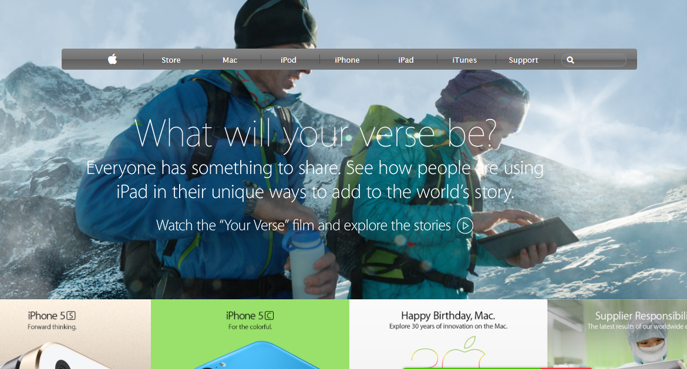

# APPLE-Clone
This project consists of building a webpage using images as a background and adding gradients to elements. The goal is to make a clone of old an old version of the Apple website webpage.
​

​
## Project Requirements
​
- Align all elements with float and flex or grid.
- The CSS background should cover the whole page irrespective of the screen size. 
- Navbar contains color gradients
​
### Images
​
- It has Image as background 
- It has thumbnails 
​
## Built With
​
- HTML
- CSS
​
## Live Demo
​
[Live Demo Link](https://lichapa.github.io/APPLE-Clone/
)
​
## Authors
​
👤 **Author1**
​
- Github: [@DeliceLydia](https://github.com/DeliceLydia)
- Twitter: [@IngabireLydia3](https://twitter.com/IngabireLydia)
- Linkedin: [Delice Lydia](https://www.linkedin.com/in/delice-lydia-91b55b167/)
​
👤 **Author2**
​
- Github: [@Lichapa](https://github.com/Lichapa)
- Linkedin: [mphatsolichapa](https://www.linkedin.com/in/mphatsolichapa/)
​
## Show your support
​
Give a ⭐️ if you like this project!